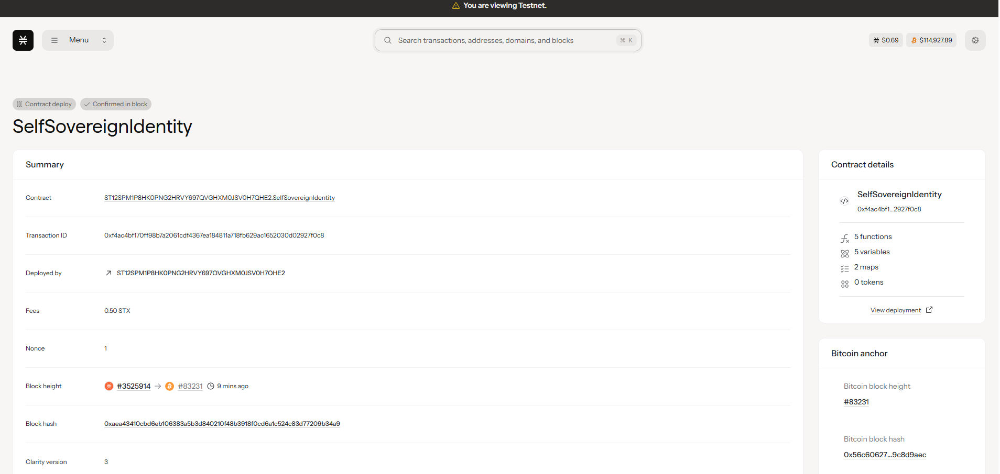

# SelfSovereignIdentity

## Project Description

SelfSovereignIdentity is a blockchain-based smart contract system built on Stacks that enables users to maintain complete control over their digital identity. The system implements privacy-preserving identity management with selective disclosure capabilities, allowing users to share specific identity attributes with trusted parties without revealing their complete identity profile.

The contract provides a decentralized approach to identity verification where users register their identity with cryptographic proofs and can create selective disclosures for specific requesters. This ensures that personal data remains under user control while enabling necessary identity verification processes in a privacy-conscious manner.

Key features include:
- **User-Controlled Identity Registration**: Users register their Decentralized Identifier (DID) along with cryptographic keys
- **Privacy-Preserving Metadata**: Only hashes of sensitive metadata are stored on-chain
- **Selective Disclosure System**: Users can create specific data disclosures for authorized requesters
- **Cryptographic Security**: Built-in validation and security measures for all identity operations

## Project Vision

Our vision is to create a truly self-sovereign identity ecosystem where individuals have complete autonomy over their digital identity. We envision a future where:

- **Privacy by Design**: Personal data remains private by default, with users having granular control over what information they share and with whom
- **Decentralized Trust**: Eliminate dependence on centralized identity providers and create a trustless system for identity verification
- **Interoperability**: Enable seamless identity verification across different platforms and services while maintaining user privacy
- **User Empowerment**: Give individuals the tools and control to manage their digital identity without intermediaries
- **Global Accessibility**: Provide identity solutions that work across borders and jurisdictions, enabling financial inclusion and digital participation for everyone

## Future Scope

The SelfSovereignIdentity project has extensive potential for expansion and enhancement:

### Phase 1 - Enhanced Privacy Features
- **Zero-Knowledge Proofs**: Implement ZK-SNARK/STARK protocols for identity verification without revealing actual data
- **Multi-Signature Support**: Add multi-sig capabilities for enhanced security in identity management
- **Revocation Mechanisms**: Implement identity and disclosure revocation systems

### Phase 2 - Advanced Identity Features
- **Credential Issuance**: Enable trusted entities to issue verifiable credentials to identity holders
- **Identity Recovery**: Implement social recovery mechanisms for lost keys or compromised identities
- **Reputation System**: Build decentralized reputation scoring based on verified interactions

### Phase 3 - Ecosystem Integration
- **Cross-Chain Compatibility**: Extend support to other blockchain networks for broader adoption
- **Mobile SDK**: Develop mobile applications for easy identity management
- **API Gateway**: Create standardized APIs for third-party integrations

### Phase 4 - Advanced Applications
- **DeFi Integration**: Enable identity-based lending, borrowing, and financial services
- **Governance Participation**: Allow verified identities to participate in DAO governance
- **Compliance Tools**: Build regulatory compliance features for institutions

### Long-term Vision
- **AI Privacy Protection**: Integrate AI-powered privacy protection mechanisms
- **Quantum-Resistant Cryptography**: Upgrade to post-quantum cryptographic standards
- **Global Identity Standard**: Establish industry standards for self-sovereign identity systems

## Contract Address Details
Contract Identifier: ST12SPM1P8HK0PNG2HRVY697QVGHXM0JSV0H7QHE2.SelfSovereignIdentity 

**Testnet Deployment:**
- Network: Stacks Testnet
- Contract Address: [To be updated]
- Deployment Block: [To be updated]
- Transaction ID: [To be updated]

**Mainnet Deployment:**
- Network: Stacks Mainnet  
- Contract Address: [To be updated]
- Deployment Block: [To be updated]
- Transaction ID: [To be updated]

---

## Technical Specifications

- **Blockchain**: Stacks
- **Language**: Clarity
- **Functions**: 2 main functions (register-identity, create-selective-disclosure)
- **Storage**: On-chain metadata hashes with off-chain data storage
- **Security**: Cryptographic validation and access controls

## Getting Started

1. Deploy the contract to your preferred Stacks network
2. Use `register-identity` to create your self-sovereign identity
3. Create selective disclosures using `create-selective-disclosure` for specific data sharing needs
4. Query identity and disclosure information using the provided read-only functions

## License

This project is open-source and available under the MIT License.